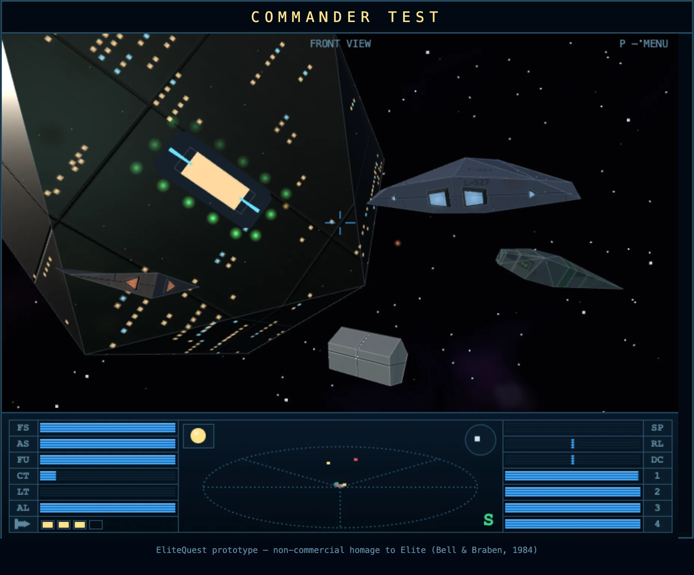
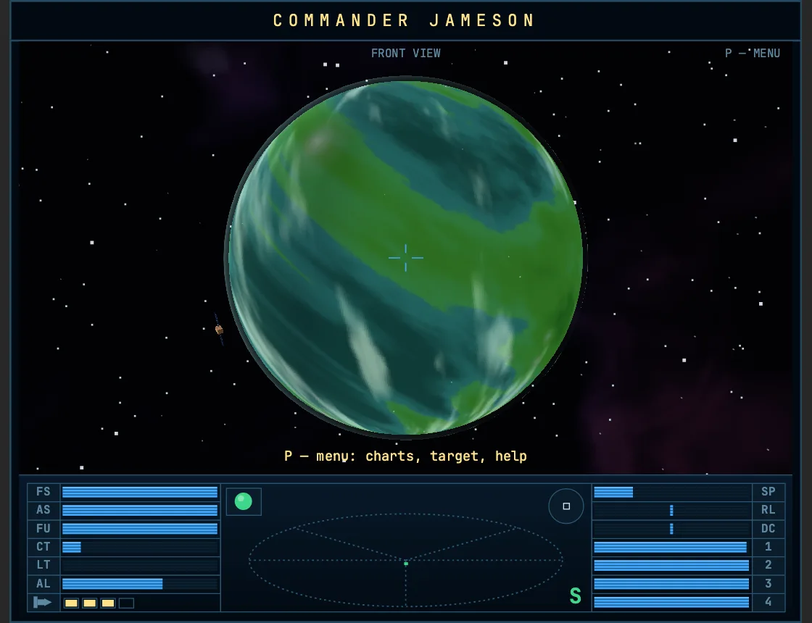
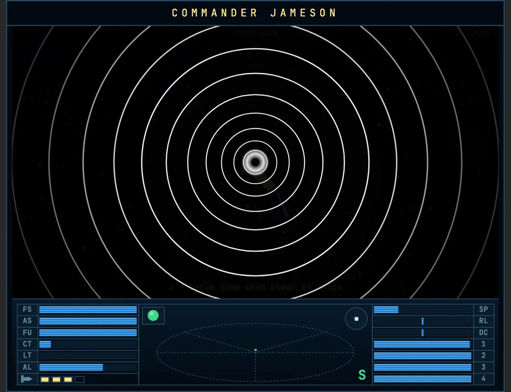
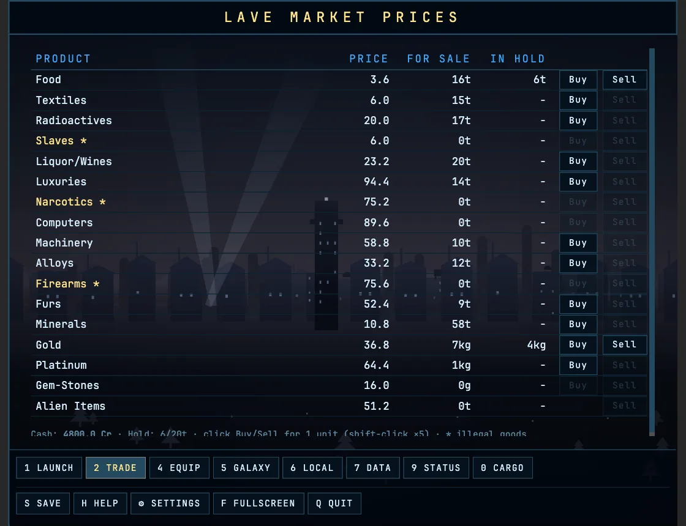
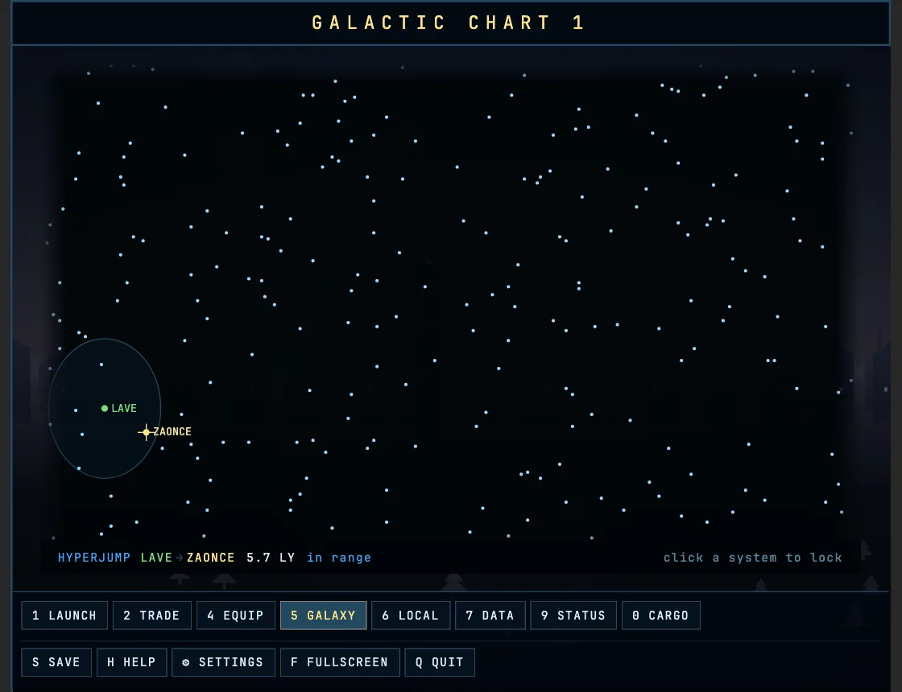
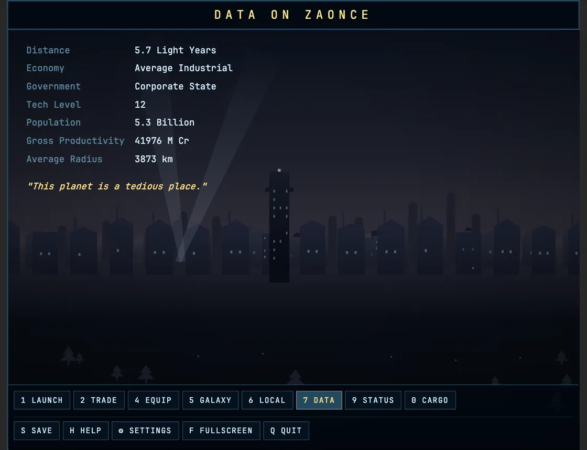
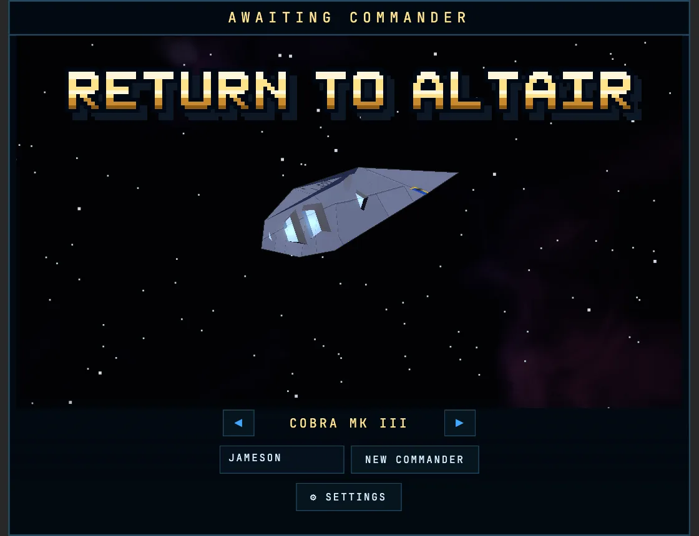

# Return to Altair

### ▶ **[Play it in your browser](https://pavel-zheltiakov.github.io/ReturnToAltair/)**

No install, no download, no account. It runs entirely in the tab.

Eight galaxies, 2 048 star systems and an open-ended trading career, in textured 3-D. The
universe is generated rather than stored: the same seed always builds the same galaxy, so
Lave sits in the same place on every machine and in every session.

---

## What you do

You start docked at Lave with a Drake Mk III, 100 credits, a pulse laser and a hold full of
nothing. There is no plot and nobody tells you what to do.

1. **Trade.** Buy cheap, jump somewhere that wants it, sell dear. Agricultural worlds sell
   food and furs and crave machinery and computers; industrial worlds are the reverse. Some
   goods are illegal in some jurisdictions, which is where the money is.
2. **Fly.** Launch, line up the planet, and use the torus drive to cross the system in
   seconds — it disengages the moment anything gets close enough to mass-lock you.
3. **Survive.** Pirates spawn according to the government type of the system you are in.
   An anarchy is a shooting gallery; a corporate state is a quiet commute.
4. **Jump.** Pick a system within fuel range on the chart, and hyperspace out. Rarely, the
   jump misfires and drops you into witch-space, which is not empty.
5. **Get rich, then get dangerous.** Better lasers, shields, an ECM, fuel scoops, a docking
   computer, and eventually the galactic hyperdrive that moves you between all eight
   galaxies.

Your combat kills push you up a rating ladder — Harmless, Mostly Harmless, Poor, Average,
and on up. Almost nobody ever reaches the top of it.

---

## Controls

Everything is keyboard. Nothing needs to be held down except the flight controls.

### In flight

| Key | Action |
|---|---|
| **← →** | roll |
| **↑ ↓** | pitch — dive and climb |
| **SPACE** | accelerate |
| **Z** | decelerate |
| **A** | fire laser |
| **J** | torus jump — fast travel across the system, blocked when mass-locked |
| **H** | hyperspace to the system you locked on the chart |
| **G** | galactic hyperdrive — jump to the next galaxy (needs the equipment) |
| **C** | docking computer — instant dock inside the station's safe zone |
| **P** | pause menu: charts, prices, status, help |
| **F** | fullscreen |
| **M** | sound on / off |

You can also dock by hand: match the station's rotation and fly straight into the slot. It
is unforgiving, which is the point.

### Screens

The number keys mean the same screen whether you are docked or paused in flight — the four
that need a station simply do nothing out in space.

| Key | Screen | |
|---|---|---|
| **1** | Launch | docked only |
| **2** / **3** | Trade — buy and sell on one screen | docked only |
| **4** | Equip Ship | docked only |
| **5** | Galactic Chart | |
| **6** | Short Range Chart | |
| **7** | Data on System | |
| **8** | Market Prices — read-only in flight | |
| **9** | Status | |
| **0** | Inventory | |
| **S** | Save commander | docked only |
| **H** | Help | |
| **F** | Fullscreen | |
| **Q** | Quit to the title screen — press twice | |
| **M** | Sound on / off | |

Save, Help, Fullscreen and Quit sit on a row of their own under the screen buttons, in the
same place on every screen.

On either chart, **click a system** to lock it as your hyperspace target. The readout along
the foot of the map names where you are and what you have locked, how far it is, and whether
your tank covers it — and the ring drawn around your own system is how far that tank reaches.
It is a circle on the short range chart and an ellipse on the galactic one, because that
chart squeezes the galaxy into a wider-than-tall panel; both enclose exactly the systems you
can reach.

### Reading the dashboard

| | | | |
|---|---|---|---|
| **FS** / **AS** | forward / aft shield | **SP** | speed |
| **FU** | fuel, in light years | **RL** | roll rate |
| **CT** | cabin temperature — rises near the sun | **DC** | dive/climb rate |
| **LT** | laser temperature — it will overheat | **1–4** | energy banks |
| **AL** | altitude above the planet | lamp | condition: green clear, amber hostiles on the scanner, red hull damage |
| rocket | missiles remaining | dial | station compass, filled when it's ahead of you |

Bars read **cyan when healthy, amber as a warning, red when it matters**, and they know
which way round they go: shields and fuel warn as they *empty*, the two temperature gauges
warn as they *fill*. **RL** and **DC** are centre-zero dials rather than bars — the marker
sits in the middle when you are flying level.

The ellipse in the middle is the scanner: your ship sits at the centre, and each blip's
vertical stalk shows whether a contact is above or below you. During a jump the countdown
replaces the safe-zone marker at the bottom right, counting down to zero.

## Sound

There are no audio files to download — every note is generated in the browser from
oscillators and noise.

**Effects.** Laser fire, hull hits, explosions, the launch and hyperspace sweeps, the tick of
the jump countdown and the blip of the station computer each have their own voice.

**Ambience.** Three beds that crossfade with where you are: the deep hum and air handling of
a station while you are docked, your own engine out in open space, and — the moment anything
hostile shows on the scanner — a pulse under an interval that refuses to resolve. The music
changing means exactly what the condition lamp going amber means.

Press **M** to silence all of it; the choice is remembered. Nothing plays until you press a
key — browsers require that, and it means the game never makes noise at a page you have not
started. Switching to another tab pauses the sound rather than droning on behind you.

---

## Saves

Your commander is stored **in your own browser**, not on a server — there is no server.

- Press **S** while docked to write a checkpoint you chose.
- The game also **autosaves every time you dock**, into a separate slot, so closing the tab
  can't cost you an hour of trading. It never overwrites a save you made yourself.
- **CONTINUE** on the title screen resumes whichever of the two is newer.

Because saves live in the browser, they are tied to this site and this browser. Clearing
your site data will erase them, private windows forget them when closed, and they do not
follow you to another device.

---

## More screenshots

**Flight — approaching a planet.** Terrain, ice caps and cloud are generated procedurally
from the system's own seed, so every world is different and every world is stable.

**Hyperspace.** Press **H**, watch the countdown run down on the dashboard, and the tunnel
opens in rushing concentric circles. Launching out of the station does the same thing, a
little quicker.

**The market at Lave.** Prices and available quantities move with the system's economy and
government; the starred goods are the ones that will get you arrested. Station screens paint
themselves a row at a time, the way the ship's computer would.

**The galactic chart.** All 256 systems of galaxy 1. Click one to lock it for hyperspace —
if it's inside your fuel range.

**System data.** Economy, government, tech level, population and productivity, plus the
procedurally generated description — all derived from the system's seed.

**Title screen.** Cycle through the starter hulls with the arrows before you name your
commander.

---

## Requirements

A desktop browser with **WebGL 2** — current Chrome, Firefox, Edge or Safari. A keyboard is
required; there is no touch or gamepad support yet.

## Status

This is a **prototype**, and an honest list of what is missing: no missions, no ECM or
missiles in flight yet, front view only, simplified docking and pirate AI, and floating-point
maths where the real thing used fixed-point. The authentic ZX Spectrum wireframe and IBM PC
flat-shaded render modes are planned as switchable options; right now there is only the
textured "remastered" look.

## Rights

Early access, and free while it stays there.

© 2026 Pavel Zheltiakov. All rights reserved — see [LICENSE](LICENSE).
